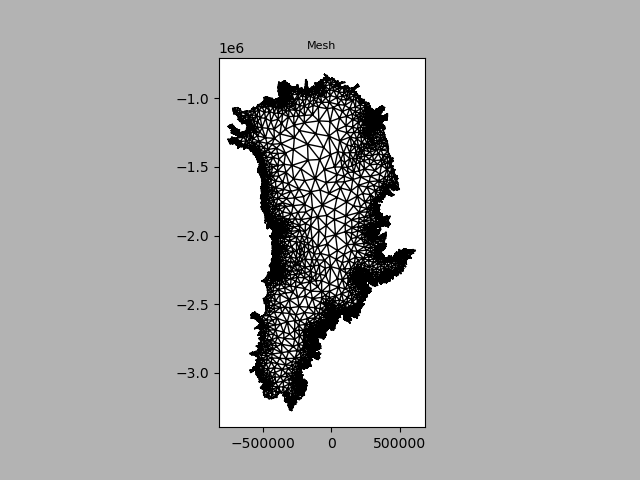

# ISSM-2026.2 Container Environment 
# (with MVAPICH-4.1, PETSc-3.22.2 & MUMPS-5.7.3)


This repository contains:

* the Docker recipe to compile the **Ice-sheet and Sea-level System Model (ISSM)** version **2026.2**, coupled with **PETSc-3.22.2** and **MUMPS-5.7.3**. It is powered by a Conda environment handling the compilation toolchain (GCC-13) and MPI runtime via **MVAPICH-4.1** supporting both UCX (for Mellanox type Infiniband) and OFI/CXI (for Cray/HPE's Slingshot Host Systems);
  
* instructions to run a Greenland example using Docker (on a personal computer or Virtual Machine) and Singularity/Apptainer (on a HPC like Olivia).



---

## Reproducing the Greenland Stressbalance benchmark

### Prerequisites

Clone the ISSM repository and download the input data:

```bash
git clone https://github.com/ISSMteam/ISSM.git ./ISSM
mkdir -p ./ISSM/examples/Data
wget --no-check-certificate \
  -O ./ISSM/examples/Data/Greenland_5km_dev1.2.nc \
  https://issm.jpl.nasa.gov/files/examples/Greenland_5km_dev1.2.nc
mkdir -p ./execution_scratch
```

---

### On a PC or VM with Docker

**Step 1 — Pull the image:**

```bash
docker pull ghcr.io/j34ni/issm:ce11b70960e94647ab4d9efcf35a0e1cf922f541
```

Or build it locally from this repository:

```bash
docker build -t issm .
```

**Step 2 — Generate the model binary (`Greenland.bin`):**

Edit `ISSM/examples/Greenland/runme.py` and set:
```python
steps = [1, 2, 3]
```
in the same file comment out line 100 and replace it to have:
```python
100 #   md = solve(md, 'Stressbalance')
101 # --- Interception block for HPC Benchmarking ---
102     from marshall import marshall
103     md.miscellaneous.name = 'Greenland'
104 
105     # Write the geometry payload
106     marshall(md)
107 
108     # WRITE THE MISSING PETSC OPTIONS FILE (Add this line)
109     md.toolkits.ToolkitsFile('Greenland.toolkits')
110 
111     print("✅ Benchmark files 'Greenland.bin' and 'Greenland.toolkits' successfully generated!")
```

Then run:
```bash
docker run --rm \
  -v $(pwd)/ISSM:/opt/uio \
  -v $(pwd)/execution_scratch:/opt/issm/execution \
  issm \
  /opt/start.sh bash -c "cd /opt/uio/examples/Greenland && python3 runme.py"
```

This generates `ISSM/examples/Greenland/Greenland.bin`.

**Step 3 — Run the solver:**

```bash
docker run --rm \
  --env OMP_NUM_THREADS=1 \
  --env OPENBLAS_NUM_THREADS=1 \
  -v $(pwd)/ISSM:/opt/uio \
  -v $(pwd)/execution_scratch:/opt/issm/execution \
  issm \
  /opt/start.sh mpirun -n 4 /opt/issm/bin/issm.exe StressbalanceSolution \
  /opt/uio/examples/Greenland Greenland
```
it should show something like:

```bash
──────────────────────────────────────────────────────────────────────
Ice-sheet and Sea-level System Model (ISSM) version 2026.1
          GitHub: https://github.com/ISSMteam/ISSM/
   Documentation: https://issmteam.github.io/ISSM-Documentation/
──────────────────────────────────────────────────────────────────────
call computational core:
   preparing initial solution

       x       |  Cost function f(x)  |  List of contributions
====================== step 1/30 ===============================
 x =         0 |    computing velocities
   computing adjoint
   saving results
f(x) =     59172.79  |       7092.887      52079.9 6.085212e-32
 x =         1 | f(x) =     50954.87  |       3600.244     47354.58   0.04587451
====================== step 2/30 ===============================
 x =         0 |    computing velocities
   computing adjoint
   saving results
f(x) =     50953.45  |       3598.809      47354.6   0.04587451
 x =         1 | f(x) =     44978.74  |       2137.679     42840.82    0.2370654
====================== step 3/30 ===============================
 x =         0 |    computing velocities
   computing adjoint
   saving results
f(x) =     44987.02  |       2146.197     42840.58    0.2370654
 x =         1 | f(x) =      44425.8  |       2044.873     42380.66    0.2722667
====================== step 4/30 ===============================
 x =         0 |    computing velocities
   computing adjoint
   saving results
f(x) =     44432.36  |       2051.851     42380.24    0.2722667
 x =         1 | f(x) =     42775.97  |       1747.394     41028.16    0.4148691
====================== step 5/30 ===============================
 x =         0 |    computing velocities
   computing adjoint
   saving results
f(x) =     42783.98  |       1756.726     41026.84    0.4148691
 x =         1 | f(x) =      41876.1  |       1659.336     40216.23    0.5302616
====================== step 6/30 ===============================
 x =         0 |    computing velocities
   computing adjoint
   saving results
f(x) =     41885.98  |       1670.347      40215.1    0.5302616
 x =         1 | f(x) =     40869.39  |       1561.173     39307.52    0.6932322
====================== step 7/30 ===============================
 x =         0 |    computing velocities
   computing adjoint
   saving results
f(x) =     40870.91  |       1563.273     39306.95    0.6932322
 x =         1 | f(x) =     39697.76  |       1338.256     38358.58    0.9236775
====================== step 8/30 ===============================
 x =         0 |    computing velocities
   computing adjoint
   saving results
f(x) =     39697.43  |       1338.655     38357.85    0.9236775
 x =         1 | f(x) =     39040.22  |       1208.675     37830.47     1.071791
====================== step 9/30 ===============================
 x =         0 |    computing velocities
   computing adjoint
   saving results
f(x) =     39039.49  |       1208.558     37829.86     1.071791
 x =         1 | f(x) =     38556.09  |       1126.764     37428.13     1.191478
====================== step 10/30 ===============================
 x =         0 |    computing velocities
   computing adjoint
   saving results
f(x) =     38552.98  |       1124.507     37427.28     1.191478
 x =         1 | f(x) =     38121.56  |       1092.495     37027.74       1.3288
====================== step 11/30 ===============================
 x =         0 |    computing velocities
   computing adjoint
   saving results
f(x) =     38122.77  |       1094.958     37026.49       1.3288
 x =         1 | f(x) =     37729.41  |       1149.628     36578.29     1.493932
====================== step 12/30 ===============================
 x =         0 |    computing velocities
   computing adjoint
   saving results
f(x) =     37740.46  |       1159.142     36579.82     1.493932
 x =         1 | f(x) =     37487.92  |       1087.186     36399.14     1.592633
 x =  0.381966 | f(x) =     37611.19  |       1112.303     36497.36     1.529775
 x =  0.618034 | f(x) =      37561.1  |       1101.089     36458.46      1.55338
 x =  0.763932 | f(x) =     37530.94  |       1093.798     36435.58     1.568476
 x =  0.854102 | f(x) =     37512.65  |       1089.499     36421.58     1.577683
 x =   0.90983 | f(x) =     37501.45  |       1086.979     36412.88     1.583344
====================== step 13/30 ===============================
 x =         0 |    computing velocities
   computing adjoint
   saving results
f(x) =     37484.86  |       1084.592     36398.67     1.592633
 x =         1 | f(x) =     37022.46  |       1018.285     36002.41     1.768007
====================== step 14/30 ===============================
 x =         0 |    computing velocities
   computing adjoint
   saving results
f(x) =      37030.9  |       1026.085     36003.05     1.768007
 x =         1 | f(x) =     36814.89  |       1058.135      35754.9     1.859438
 x =  0.381966 | f(x) =     36898.13  |       989.5907     35906.74     1.799676
 x =  0.618034 | f(x) =     36853.98  |       1003.884     35848.28     1.821225
 x =  0.763932 | f(x) =     36838.62  |       1025.038     35811.75     1.835325
 x =  0.937069 | f(x) =     36824.08  |       1052.478     35769.75     1.852853
 x =  0.870937 | f(x) =     36839.21  |       1051.966      35785.4     1.846056
====================== step 15/30 ===============================
 x =         0 |    computing velocities
   computing adjoint
   saving results
f(x) =      36824.8  |       1068.389     35754.55     1.859438
 x =         1 | f(x) =     36559.07  |       954.0377     35603.09     1.936544
 x =  0.381966 | f(x) =      36711.5  |       1017.403     35692.21     1.887487
 x =  0.618034 | f(x) =     36653.71  |       995.7569     35656.05     1.905392
 x =  0.763932 | f(x) =     36614.76  |       978.0481      35634.8     1.916939
 x =  0.854102 | f(x) =     36589.85  |       965.9689     35621.95      1.92432
 x =   0.90983 | f(x) =     36574.06  |       958.1749     35613.95     1.928974
====================== step 16/30 ===============================
 x =         0 |    computing velocities
   computing adjoint
   saving results
f(x) =     36552.27  |       948.6767     35601.65     1.936544
 x =         1 | f(x) =     36368.74  |       909.4905     35457.24     2.009954
 x =  0.381966 | f(x) =     36450.66  |       912.2196     35536.48     1.964688
 x =  0.618034 | f(x) =     36415.28  |       905.8741     35507.42     1.981913
 x =  0.763932 | f(x) =     36394.68  |       904.2792     35488.41     1.992565
 x =  0.854102 | f(x) =     36384.31  |       906.0028     35476.31     1.999281
 x =   0.90983 | f(x) =     36379.73  |       908.9319     35468.79     2.003357
====================== step 17/30 ===============================
 x =         0 |    computing velocities
   computing adjoint
   saving results
f(x) =     36373.34  |       914.7542     35456.58     2.009954
 x =         1 | f(x) =     36229.12  |       957.6674     35269.34     2.111313
 x =  0.381966 | f(x) =     36289.06  |       905.1848     35381.82     2.046875
 x =  0.618034 | f(x) =     36257.86  |       916.5034     35339.28     2.070593
 x =  0.763932 | f(x) =     36247.49  |       932.6872     35312.72     2.085785
 x =  0.913021 | f(x) =     36239.38  |       951.6387     35285.64     2.101794
 x =  0.856074 | f(x) =     36249.62  |        951.977     35295.55     2.095621
====================== step 18/30 ===============================
 x =         0 |    computing velocities
   computing adjoint
   saving results
f(x) =     36238.23  |       966.1893     35269.93     2.111313
 x =         1 | f(x) =     36005.81  |        893.306     35110.31      2.18899
 x =  0.381966 | f(x) =     36142.54  |       929.6447     35210.76     2.139784
 x =  0.618034 | f(x) =     36093.23  |       916.1558     35174.92     2.158128
 x =  0.763932 | f(x) =     36058.58  |       905.5225     35150.89      2.16975
 x =  0.854102 | f(x) =      36036.9  |       898.7214        35136     2.177043
 x =   0.90983 | f(x) =     36023.73  |       894.6151     35126.93      2.18159
====================== step 19/30 ===============================
 x =         0 |    computing velocities
   computing adjoint
   saving results
f(x) =     36005.22  |       890.2107     35112.82      2.18899
 x =         1 | f(x) =     35868.42  |       869.9581     34996.18     2.287732
 x =  0.381966 | f(x) =     35911.39  |       860.1821     35048.98     2.225541
 x =  0.618034 | f(x) =     35893.04  |       858.0691     35032.72     2.249067
 x =  0.763932 | f(x) =     35881.94  |       859.7353     35019.94     2.263658
 x =  0.854102 | f(x) =     35877.04  |        863.763     35011.01     2.272799
 x =   0.90983 | f(x) =     35875.47  |       868.0771     35005.11     2.278502
====================== step 20/30 ===============================
 x =         0 |    computing velocities
   computing adjoint
   saving results
f(x) =     35873.35  |       875.6681      34995.4     2.287732
 x =         1 | f(x) =     35723.35  |       910.5513     34810.43     2.374027
 x =  0.381966 | f(x) =     35789.66  |       860.5594     34926.79     2.319061
 x =  0.618034 | f(x) =     35757.04  |        868.789     34885.91     2.339232
 x =  0.763932 | f(x) =     35744.03  |       883.7317     34857.95     2.352231
 x =  0.854102 | f(x) =     35739.94  |       897.5494     34840.03     2.360435
 x =  0.930997 | f(x) =     35737.52  |         910.28     34824.87     2.367548
====================== step 21/30 ===============================
 x =         0 |    computing velocities
   computing adjoint
   saving results
f(x) =     35735.84  |       922.2347     34811.23     2.374027
 x =         1 | f(x) =     35602.51  |       870.7784      34729.3     2.423398
 x =  0.381966 | f(x) =     35668.82  |       880.0971     34786.33     2.391628
 x =  0.618034 | f(x) =      35644.9  |       872.7159     34769.79     2.403223
 x =  0.763932 | f(x) =     35629.08  |       870.0702      34756.6     2.410606
 x =  0.854102 | f(x) =     35618.25  |       868.4465     34747.39     2.415368
 x =   0.90983 | f(x) =     35610.89  |       867.4925     34740.98     2.418388
====================== step 22/30 ===============================
 x =         0 |    computing velocities
   computing adjoint
   saving results
f(x) =     35599.85  |       867.5045     34729.92     2.423398
 x =         1 | f(x) =     35435.33  |       841.7746     34591.04     2.515761
 x =  0.381966 | f(x) =     35503.09  |         830.83      34669.8     2.457304
 x =  0.618034 | f(x) =     35463.09  |       825.8312     34634.77     2.479098
 x =  0.763932 | f(x) =     35440.81  |       828.0732     34610.24     2.492898
 x =  0.854102 | f(x) =     35432.56  |       834.5397     34595.51     2.501553
 x =   0.90983 | f(x) =     35438.35  |       841.9242     34593.91      2.50695
====================== step 23/30 ===============================
 x =         0 |    computing velocities
   computing adjoint
   saving results
f(x) =     35439.26  |       840.4865     34596.27     2.501553
 x =         1 | f(x) =     35377.76  |       827.9223     34547.29      2.55107
 x =  0.381966 | f(x) =     35416.76  |       819.8319     34594.41     2.518729
 x =  0.618034 | f(x) =     35399.79  |       819.4099     34577.85     2.530419
 x =  0.763932 | f(x) =      35393.8  |       822.2265     34569.04     2.538053
 x =   0.94431 | f(x) =     35386.99  |       828.3332     34556.11     2.547926
 x =  0.875411 | f(x) =     35393.31  |       829.0396     34561.73     2.544098
====================== step 24/30 ===============================
 x =         0 |    computing velocities
   computing adjoint
   saving results
f(x) =     35389.04  |        833.328     34553.17      2.55107
 x =         1 | f(x) =     35252.08  |        814.333     34435.09     2.649674
 x =  0.381966 | f(x) =     35317.08  |       812.9779     34501.52     2.588143
 x =  0.618034 | f(x) =     35288.37  |       809.7173     34476.04      2.61163
 x =  0.763932 | f(x) =     35271.32  |       809.3561     34459.34     2.626303
 x =  0.854102 | f(x) =     35263.63  |       811.1879     34449.81     2.635228
 x =   0.90983 | f(x) =     35260.58  |       813.8447     34444.09     2.640722
====================== step 25/30 ===============================
 x =         0 |    computing velocities
   computing adjoint
   saving results
f(x) =     35256.61  |       818.8751     34435.09     2.649674
 x =         1 | f(x) =     35162.53  |       858.2914      34301.5     2.735673
 x =  0.381966 | f(x) =     35180.62  |       812.9343     34365.01     2.680862
 x =  0.618034 | f(x) =     35153.13  |       821.9686     34328.46     2.701318
 x =  0.763932 | f(x) =      35158.4  |       837.0532     34318.64     2.714142
 x =  0.645765 | f(x) =     35167.63  |       833.3934     34331.53     2.703724
 x =  0.527864 | f(x) =     35170.22  |       824.2443     34343.28      2.69358
====================== step 26/30 ===============================
 x =         0 |    computing velocities
   computing adjoint
   saving results
f(x) =     35160.91  |       827.0904     34331.12     2.701318
 x =         1 | f(x) =     35121.46  |       799.6845     34319.05     2.727662
 x =  0.381966 | f(x) =     35148.31  |       811.7243     34333.88     2.710514
 x =  0.618034 | f(x) =     35139.87  |       807.5904     34329.56     2.716722
 x =  0.763932 | f(x) =     35133.07  |       803.7535     34326.59      2.72077
 x =  0.854102 | f(x) =     35127.96  |       801.0183     34324.22     2.723353
 x =   0.90983 | f(x) =     35124.32  |       799.2121     34322.38      2.72498
====================== step 27/30 ===============================
 x =         0 |    computing velocities
   computing adjoint
   saving results
f(x) =     35118.96  |       797.3039     34318.93     2.727662
 x =         1 | f(x) =     34992.03  |       809.2472     34179.95     2.832733
 x =  0.381966 | f(x) =     35054.04  |        790.942     34260.33     2.766217
 x =  0.618034 | f(x) =     35029.19  |       793.4466     34232.96     2.790918
 x =  0.763932 | f(x) =     35015.11  |       799.2226     34213.08      2.80662
 x =  0.854102 | f(x) =     35009.11  |       806.1052     34200.19     2.816492
 x =   0.90983 | f(x) =      35007.4  |       812.5976     34191.98     2.822656
====================== step 28/30 ===============================
 x =         0 |    computing velocities
   computing adjoint
   saving results
f(x) =     35004.34  |       822.0412     34179.46     2.832733
 x =         1 | f(x) =     34934.89  |       806.5681     34125.45     2.869497
 x =  0.381966 | f(x) =     34947.19  |       786.7808     34157.56     2.846455
 x =  0.618034 | f(x) =     34937.15  |       788.8938      34145.4     2.855031
 x =  0.763932 | f(x) =     34935.72  |       795.0425     34137.82      2.86044
 x =  0.748018 | f(x) =     34937.96  |       796.5474     34138.55     2.859846
 x =  0.854102 | f(x) =     34938.59  |       802.5736     34133.15     2.863846
====================== step 29/30 ===============================
 x =         0 |    computing velocities
   computing adjoint
   saving results
f(x) =     34941.31  |       812.7686     34125.68     2.869497
 x =         1 | f(x) =     34824.79  |       779.5766     34042.28      2.93568
 x =  0.381966 | f(x) =     34880.06  |       788.1494     34089.01     2.894422
 x =  0.618034 | f(x) =     34858.61  |       784.1182     34071.59     2.910003
 x =  0.763932 | f(x) =      34843.9  |       780.8724     34060.11     2.919785
 x =  0.854102 | f(x) =     34835.34  |         779.39     34053.03     2.925878
 x =   0.90983 | f(x) =     34830.75  |       779.0448     34048.78     2.929605
====================== step 30/30 ===============================
 x =         0 |    computing velocities
   computing adjoint
   saving results
f(x) =     34824.92  |       779.6845      34042.3      2.93568
 x =         1 | f(x) =     34721.73  |        773.825     33944.89     3.012809
 x =  0.381966 | f(x) =     34777.78  |       771.9949     34002.83       2.9647
 x =  0.618034 | f(x) =     34756.76  |       772.5229     33981.26     2.983074
 x =  0.763932 | f(x) =     34743.46  |       772.8113     33967.65     2.994358
 x =  0.854102 | f(x) =     34735.33  |       773.2087     33959.12     3.001398
 x =   0.90983 | f(x) =     34730.47  |       773.6108     33953.85      3.00576
   preparing final solution
   computing new velocity
write lock file:

   FemModel initialization elapsed time:   0.0558596
   Total Core solution elapsed time:       19.2636
   Linear solver elapsed time:             11.3177 (59%)

   Total elapsed time: 0 hrs 0 min 19 sec
```


---

### On Olivia (NRIS HPC) with Apptainer

**Step 1 — Set up directories and pull the image:**

```bash
BASE_DIR=${PWD} (or for example "/cluster/projects/nnxxxk/issm")

mkdir -p ${BASE_DIR}/execution_scratch
mkdir -p ${BASE_DIR}/ISSM/examples/Data

wget --no-check-certificate \
  -O ${BASE_DIR}/ISSM/examples/Data/Greenland_5km_dev1.2.nc \
  https://issm.jpl.nasa.gov/files/examples/Greenland_5km_dev1.2.nc

apptainer pull ${BASE_DIR}/issm.sif \
  docker://ghcr.io/j34ni/issm:ce11b70960e94647ab4d9efcf35a0e1cf922f541
```

**Step 2 — Clone ISSM:**

```bash
git clone https://github.com/ISSMteam/ISSM.git ${BASE_DIR}/ISSM
```

**Step 3 — Generate the model binary on the login node:**

Edit `${BASE_DIR}/ISSM/examples/Greenland/runme.py` and set:
```python
steps = [1, 2, 3]
```
in the same file comment out line 100 and replace it to have:
```python
100 #   md = solve(md, 'Stressbalance')
101 # --- Interception block for HPC Benchmarking ---
102     from marshall import marshall
103     md.miscellaneous.name = 'Greenland'
104 
105     # Write the geometry payload
106     marshall(md)
107 
108     # WRITE THE MISSING PETSC OPTIONS FILE (Add this line)
109     md.toolkits.ToolkitsFile('Greenland.toolkits')
110 
111     print("✅ Benchmark files 'Greenland.bin' and 'Greenland.toolkits' successfully generated!")
```

Then run:
```bash
apptainer exec \
  --bind ${BASE_DIR}/ISSM:/opt/uio,${BASE_DIR}/execution_scratch:/opt/issm/execution \
  ${BASE_DIR}/issm.sif \
  /opt/start.sh bash -c "cd /opt/uio/examples/Greenland && python3 runme.py"
```

This generates `${BASE_DIR}/ISSM/examples/Greenland/Greenland.bin`.

Ignore the error message, as long as it displays:

✅ Benchmark files `Greenland.bin` and `Greenland.toolkits` successfully generated!


**Step 4 — Submit the solver job:**

Create `job.sh`:

```bash
#!/bin/bash
#SBATCH --job-name=issm_greenland
#SBATCH --account=nnxxxxk                           <-  Use your actual account number here
#SBATCH --time=00:10:00
#SBATCH --partition=large
#SBATCH --nodes=2
#SBATCH --ntasks=64
#SBATCH --ntasks-per-node=32

IMAGE='issm.sif'

export APPTAINER_QUIET=1
export MPICH_CH4_NETMOD=ofi
export FI_PROVIDER=cxi
export OMP_NUM_THREADS=1
export OPENBLAS_NUM_THREADS=1
export UCX_POSIX_USE_PROC_LINK=n

BASE_DIR=${PWD}
WORKDIR="${BASE_DIR}/ISSM/examples/Greenland"

export APPTAINER_BIND="${BASE_DIR}/ISSM:/opt/uio,${BASE_DIR}/execution_scratch:/opt/issm/execution"

cd $WORKDIR

srun -n $SLURM_NTASKS --mpi=pmi2 \
    apptainer exec ${BASE_DIR}/${IMAGE} \
    /opt/start.sh /opt/issm/bin/issm.exe StressbalanceSolution \
    /opt/uio/examples/Greenland Greenland \
    -malloc_off
```

Submit:
```bash
sbatch job.sh
```
Check the log:
```bash

──────────────────────────────────────────────────────────────────────
Ice-sheet and Sea-level System Model (ISSM) version 2026.1
          GitHub: https://github.com/ISSMteam/ISSM/
   Documentation: https://issmteam.github.io/ISSM-Documentation/
──────────────────────────────────────────────────────────────────────
call computational core:
   preparing initial solution

       x       |  Cost function f(x)  |  List of contributions
====================== step 1/30 ===============================
 x =         0 |    computing velocities
   computing adjoint
   saving results
f(x) =     59172.79  |       7092.887      52079.9 6.085212e-32
 x =         1 | f(x) =     50954.87  |       3600.244     47354.58   0.04587451
====================== step 2/30 ===============================
 x =         0 |    computing velocities
   computing adjoint
   saving results
f(x) =     50953.45  |       3598.809      47354.6   0.04587451
 x =         1 | f(x) =     44978.74  |       2137.679     42840.82    0.2370654
====================== step 3/30 ===============================
 x =         0 |    computing velocities
   computing adjoint
   saving results
f(x) =     44987.02  |       2146.197     42840.58    0.2370654
 x =         1 | f(x) =      44425.8  |       2044.873     42380.66    0.2722667
====================== step 4/30 ===============================
 x =         0 |    computing velocities
   computing adjoint
   saving results
f(x) =     44432.36  |       2051.851     42380.24    0.2722667
 x =         1 | f(x) =     42775.97  |       1747.394     41028.16    0.4148691
====================== step 5/30 ===============================
 x =         0 |    computing velocities
   computing adjoint
   saving results
f(x) =     42783.98  |       1756.726     41026.84    0.4148691
 x =         1 | f(x) =      41876.1  |       1659.336     40216.23    0.5302616
====================== step 6/30 ===============================
 x =         0 |    computing velocities
   computing adjoint
   saving results
f(x) =     41885.98  |       1670.347      40215.1    0.5302616
 x =         1 | f(x) =     40869.39  |       1561.173     39307.52    0.6932322
====================== step 7/30 ===============================
 x =         0 |    computing velocities
   computing adjoint
   saving results
f(x) =     40870.91  |       1563.273     39306.95    0.6932322
 x =         1 | f(x) =     39697.76  |       1338.256     38358.58    0.9236775
====================== step 8/30 ===============================
 x =         0 |    computing velocities
   computing adjoint
   saving results
f(x) =     39697.43  |       1338.655     38357.85    0.9236775
 x =         1 | f(x) =     39040.22  |       1208.675     37830.47     1.071791
====================== step 9/30 ===============================
 x =         0 |    computing velocities
   computing adjoint
   saving results
f(x) =     39039.49  |       1208.558     37829.86     1.071791
 x =         1 | f(x) =     38556.09  |       1126.764     37428.13     1.191478
====================== step 10/30 ===============================
 x =         0 |    computing velocities
   computing adjoint
   saving results
f(x) =     38552.98  |       1124.507     37427.28     1.191478
 x =         1 | f(x) =     38121.56  |       1092.495     37027.74       1.3288
====================== step 11/30 ===============================
 x =         0 |    computing velocities
   computing adjoint
   saving results
f(x) =     38122.77  |       1094.958     37026.49       1.3288
 x =         1 | f(x) =     37729.41  |       1149.628     36578.29     1.493932
====================== step 12/30 ===============================
 x =         0 |    computing velocities
   computing adjoint
   saving results
f(x) =     37740.46  |       1159.142     36579.82     1.493932
 x =         1 | f(x) =     37487.92  |       1087.186     36399.14     1.592633
 x =  0.381966 | f(x) =     37611.19  |       1112.303     36497.36     1.529775
 x =  0.618034 | f(x) =      37561.1  |       1101.089     36458.46      1.55338
 x =  0.763932 | f(x) =     37530.94  |       1093.798     36435.58     1.568476
 x =  0.854102 | f(x) =     37512.65  |       1089.499     36421.58     1.577683
 x =   0.90983 | f(x) =     37501.45  |       1086.979     36412.88     1.583344
====================== step 13/30 ===============================
 x =         0 |    computing velocities
   computing adjoint
   saving results
f(x) =     37484.86  |       1084.592     36398.67     1.592633
 x =         1 | f(x) =     37022.46  |       1018.285     36002.41     1.768007
====================== step 14/30 ===============================
 x =         0 |    computing velocities
   computing adjoint
   saving results
f(x) =      37030.9  |       1026.085     36003.05     1.768007
 x =         1 | f(x) =     36814.89  |       1058.135      35754.9     1.859438
 x =  0.381966 | f(x) =     36898.13  |       989.5907     35906.74     1.799676
 x =  0.618034 | f(x) =     36853.98  |       1003.884     35848.28     1.821225
 x =  0.763932 | f(x) =     36838.62  |       1025.038     35811.75     1.835325
 x =  0.937069 | f(x) =     36824.08  |       1052.478     35769.75     1.852853
 x =  0.870937 | f(x) =     36839.21  |       1051.966      35785.4     1.846056
====================== step 15/30 ===============================
 x =         0 |    computing velocities
   computing adjoint
   saving results
f(x) =      36824.8  |       1068.389     35754.55     1.859438
 x =         1 | f(x) =     36559.07  |       954.0377     35603.09     1.936544
 x =  0.381966 | f(x) =      36711.5  |       1017.403     35692.21     1.887487
 x =  0.618034 | f(x) =     36653.71  |       995.7569     35656.05     1.905392
 x =  0.763932 | f(x) =     36614.76  |       978.0481      35634.8     1.916939
 x =  0.854102 | f(x) =     36589.85  |       965.9689     35621.95      1.92432
 x =   0.90983 | f(x) =     36574.06  |       958.1749     35613.95     1.928974
====================== step 16/30 ===============================
 x =         0 |    computing velocities
   computing adjoint
   saving results
f(x) =     36552.27  |       948.6767     35601.65     1.936544
 x =         1 | f(x) =     36368.74  |       909.4905     35457.24     2.009954
 x =  0.381966 | f(x) =     36450.66  |       912.2196     35536.48     1.964688
 x =  0.618034 | f(x) =     36415.28  |       905.8741     35507.42     1.981913
 x =  0.763932 | f(x) =     36394.68  |       904.2792     35488.41     1.992565
 x =  0.854102 | f(x) =     36384.31  |       906.0028     35476.31     1.999281
 x =   0.90983 | f(x) =     36379.73  |       908.9319     35468.79     2.003357
====================== step 17/30 ===============================
 x =         0 |    computing velocities
   computing adjoint
   saving results
f(x) =     36373.34  |       914.7542     35456.58     2.009954
 x =         1 | f(x) =     36229.12  |       957.6674     35269.34     2.111313
 x =  0.381966 | f(x) =     36289.06  |       905.1848     35381.82     2.046875
 x =  0.618034 | f(x) =     36257.86  |       916.5034     35339.28     2.070593
 x =  0.763932 | f(x) =     36247.49  |       932.6872     35312.72     2.085785
 x =  0.913021 | f(x) =     36239.38  |       951.6387     35285.64     2.101794
 x =  0.856074 | f(x) =     36249.62  |        951.977     35295.55     2.095621
====================== step 18/30 ===============================
 x =         0 |    computing velocities
   computing adjoint
   saving results
f(x) =     36238.23  |       966.1893     35269.93     2.111313
 x =         1 | f(x) =     36005.81  |        893.306     35110.31      2.18899
 x =  0.381966 | f(x) =     36142.54  |       929.6447     35210.76     2.139784
 x =  0.618034 | f(x) =     36093.23  |       916.1558     35174.92     2.158128
 x =  0.763932 | f(x) =     36058.58  |       905.5225     35150.89     2.169751
 x =  0.854102 | f(x) =      36036.9  |       898.7214        35136     2.177043
 x =   0.90983 | f(x) =     36023.73  |       894.6151     35126.93      2.18159
====================== step 19/30 ===============================
 x =         0 |    computing velocities
   computing adjoint
   saving results
f(x) =     36005.22  |       890.2107     35112.82      2.18899
 x =         1 | f(x) =     35868.42  |       869.9581     34996.18     2.287732
 x =  0.381966 | f(x) =     35911.39  |       860.1821     35048.98     2.225541
 x =  0.618034 | f(x) =     35893.04  |       858.0691     35032.72     2.249067
 x =  0.763932 | f(x) =     35881.94  |       859.7353     35019.94     2.263658
 x =  0.854102 | f(x) =     35877.04  |        863.763     35011.01     2.272799
 x =   0.90983 | f(x) =     35875.47  |       868.0771     35005.11     2.278502
====================== step 20/30 ===============================
 x =         0 |    computing velocities
   computing adjoint
   saving results
f(x) =     35873.35  |       875.6681      34995.4     2.287732
 x =         1 | f(x) =     35723.35  |       910.5513     34810.43     2.374027
 x =  0.381966 | f(x) =     35789.66  |       860.5594     34926.79     2.319061
 x =  0.618034 | f(x) =     35757.04  |        868.789     34885.91     2.339232
 x =  0.763932 | f(x) =     35744.03  |       883.7317     34857.95     2.352231
 x =  0.854102 | f(x) =     35739.94  |       897.5494     34840.03     2.360435
 x =  0.930997 | f(x) =     35737.52  |         910.28     34824.87     2.367548
====================== step 21/30 ===============================
 x =         0 |    computing velocities
   computing adjoint
   saving results
f(x) =     35735.84  |       922.2347     34811.23     2.374027
 x =         1 | f(x) =     35602.51  |       870.7784      34729.3     2.423398
 x =  0.381966 | f(x) =     35668.82  |       880.0971     34786.33     2.391628
 x =  0.618034 | f(x) =      35644.9  |       872.7159     34769.79     2.403223
 x =  0.763932 | f(x) =     35629.08  |       870.0702      34756.6     2.410606
 x =  0.854102 | f(x) =     35618.25  |       868.4465     34747.39     2.415368
 x =   0.90983 | f(x) =     35610.89  |       867.4925     34740.98     2.418388
====================== step 22/30 ===============================
 x =         0 |    computing velocities
   computing adjoint
   saving results
f(x) =     35599.85  |       867.5045     34729.92     2.423398
 x =         1 | f(x) =     35435.33  |       841.7746     34591.04     2.515761
 x =  0.381966 | f(x) =     35503.09  |         830.83      34669.8     2.457304
 x =  0.618034 | f(x) =     35463.09  |       825.8312     34634.77     2.479098
 x =  0.763932 | f(x) =     35440.81  |       828.0732     34610.24     2.492898
 x =  0.854102 | f(x) =     35432.56  |       834.5397     34595.51     2.501553
 x =   0.90983 | f(x) =     35438.35  |       841.9242     34593.91      2.50695
====================== step 23/30 ===============================
 x =         0 |    computing velocities
   computing adjoint
   saving results
f(x) =     35439.26  |       840.4865     34596.27     2.501553
 x =         1 | f(x) =     35377.76  |       827.9221     34547.29      2.55107
 x =  0.381966 | f(x) =     35416.76  |       819.8319     34594.41     2.518729
 x =  0.618034 | f(x) =     35399.79  |       819.4098     34577.85     2.530419
 x =  0.763932 | f(x) =      35393.8  |       822.2264     34569.04     2.538053
 x =  0.944306 | f(x) =     35386.99  |       828.3329     34556.11     2.547925
 x =   0.87541 | f(x) =     35393.31  |       829.0393     34561.73     2.544098
====================== step 24/30 ===============================
 x =         0 |    computing velocities
   computing adjoint
   saving results
f(x) =     35389.04  |       833.3278     34553.17      2.55107
 x =         1 | f(x) =     35252.07  |       814.3331     34435.09     2.649672
 x =  0.381966 | f(x) =     35317.08  |       812.9778     34501.52     2.588142
 x =  0.618034 | f(x) =     35288.37  |       809.7173     34476.04     2.611629
 x =  0.763932 | f(x) =     35271.32  |       809.3562     34459.34     2.626302
 x =  0.854102 | f(x) =     35263.63  |        811.188     34449.81     2.635227
 x =   0.90983 | f(x) =     35260.57  |       813.8449     34444.09      2.64072
====================== step 25/30 ===============================
 x =         0 |    computing velocities
   computing adjoint
   saving results
f(x) =     35256.61  |       818.8753     34435.08     2.649672
 x =         1 | f(x) =     35162.53  |       858.2905      34301.5     2.735669
 x =  0.381966 | f(x) =     35180.62  |        812.934        34365      2.68086
 x =  0.618034 | f(x) =     35153.13  |       821.9681     34328.46     2.701316
 x =  0.763932 | f(x) =      35158.4  |       837.0524     34318.63     2.714139
 x =  0.645767 | f(x) =     35167.63  |       833.3929     34331.53     2.703722
 x =  0.527864 | f(x) =     35170.22  |       824.2438     34343.28     2.693578
====================== step 26/30 ===============================
 x =         0 |    computing velocities
   computing adjoint
   saving results
f(x) =     35160.91  |       827.0898     34331.12     2.701316
 x =         1 | f(x) =     35121.47  |       799.6858     34319.05     2.727656
 x =  0.381966 | f(x) =     35148.31  |       811.7252     34333.88     2.710509
 x =  0.618034 | f(x) =     35139.87  |       807.5915     34329.56     2.716717
 x =  0.763932 | f(x) =     35133.07  |       803.7548      34326.6     2.720764
 x =  0.854102 | f(x) =     35127.96  |       801.0197     34324.21     2.723347
 x =   0.90983 | f(x) =     35124.32  |       799.2136     34322.38     2.724974
====================== step 27/30 ===============================
 x =         0 |    computing velocities
   computing adjoint
   saving results
f(x) =     35118.96  |       797.3053     34318.93     2.727656
 x =         1 | f(x) =     34992.05  |       809.2472     34179.97     2.832716
 x =  0.381966 | f(x) =     35054.05  |       790.9418     34260.34     2.766206
 x =  0.618034 | f(x) =     35029.21  |       793.4463     34232.97     2.790905
 x =  0.763932 | f(x) =     35015.13  |       799.2222      34213.1     2.806606
 x =  0.854102 | f(x) =     35009.13  |       806.1048     34200.21     2.816476
 x =   0.90983 | f(x) =     35007.42  |       812.5973        34192      2.82264
====================== step 28/30 ===============================
 x =         0 |    computing velocities
   computing adjoint
   saving results
f(x) =     35004.36  |        822.041     34179.48     2.832716
 x =         1 | f(x) =      34934.9  |       806.5688     34125.47     2.869481
 x =  0.381966 | f(x) =     34947.21  |       786.7822     34157.58     2.846438
 x =  0.618034 | f(x) =     34937.17  |       788.8948     34145.42     2.855015
 x =  0.763932 | f(x) =     34935.74  |       795.0434     34137.84     2.860424
 x =  0.748029 | f(x) =     34937.98  |       796.5489     34138.57      2.85983
 x =  0.854102 | f(x) =     34938.61  |       802.5746     34133.17      2.86383
====================== step 29/30 ===============================
 x =         0 |    computing velocities
   computing adjoint
   saving results
f(x) =     34941.33  |       812.7694     34125.69     2.869481
 x =         1 | f(x) =     34824.81  |       779.5771      34042.3     2.935661
 x =  0.381966 | f(x) =     34880.08  |       788.1502     34089.04     2.894406
 x =  0.618034 | f(x) =     34858.63  |       784.1193      34071.6     2.909985
 x =  0.763932 | f(x) =     34843.92  |       780.8733     34060.12     2.919768
 x =  0.854102 | f(x) =     34835.36  |       779.3906     34053.04      2.92586
 x =   0.90983 | f(x) =     34830.77  |       779.0451      34048.8     2.929587
====================== step 30/30 ===============================
 x =         0 |    computing velocities
   computing adjoint
   saving results
f(x) =     34824.94  |       779.6843     34042.32     2.935661
 x =         1 | f(x) =     34721.73  |       773.8273     33944.89     3.012807
 x =  0.381966 | f(x) =     34777.79  |       771.9961     34002.83     2.964688
 x =  0.618034 | f(x) =     34756.77  |       772.5241     33981.26     2.983065
 x =  0.763932 | f(x) =     34743.46  |       772.8129     33967.65     2.994352
 x =  0.854102 | f(x) =     34735.33  |       773.2109     33959.12     3.001394
 x =   0.90983 | f(x) =     34730.47  |       773.6133     33953.85     3.005757
   preparing final solution
   computing new velocity
write lock file:

   FemModel initialization elapsed time:   0.0867468
   Total Core solution elapsed time:       8.15981
   Linear solver elapsed time:             7.57055 (93%)

   Total elapsed time: 0 hrs 0 min 8 sec

```


---
